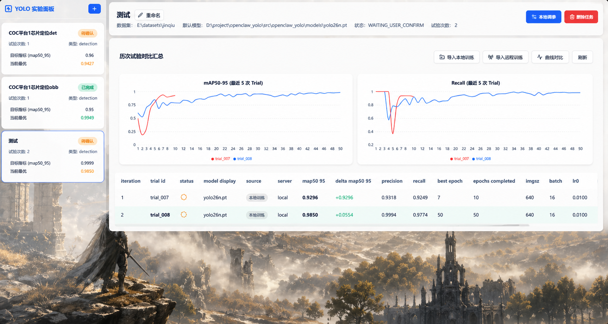

# OpenClaw YOLO — YOLO 实验管理平台

<div align="center">

**一站式 YOLO 训练实验管理系统**

管理训练参数 · 对比试验指标 · 同步远程训练 · 可视化训练曲线

`FastAPI` · `React` · `Recharts` · `SQLite` · `Ultralytics YOLO`

### 界面预览



<p><sub>实验工作台、训练曲线对比与可视化结果总览</sub></p>

</div>

---

## 📖 项目简介

**OpenClaw YOLO** 是一个面向工业视觉（AOI）场景的 YOLO 训练实验管理平台。它通过统一的 Web Dashboard 帮助工程师**创建实验、调参训练、导入结果、对比指标、可视化曲线**，摆脱手动记录 Excel 和零散脚本的低效工作流。

### 它能做什么？

| 功能 | 说明 |
|------|------|
| 📦 **实验管理** | 创建实验，绑定数据集、模型、目标指标（如 mAP50-95 ≥ 0.65） |
| 🏋️ **本地训练** | 在 Dashboard 调参后一键启动 YOLO 训练，异步监控进度 |
| 📊 **多试验对比** | 自动汇总每次训练的 Precision / Recall / mAP，表格 + 曲线对比 |
| 🖼️ **训练可视化** | 查看训练 batch 图、混淆矩阵、PR 曲线等生成图片 |
| 📥 **导入已有训练** | 将外部已完成的 YOLO run 目录直接导入，纳入对比 |
| 🌐 **远程训练同步** | 通过 SFTP 登记远程服务器上的训练任务，定期同步 `results.csv` |
| 🤖 **OpenClaw 集成** | 可选：接入 OpenClaw AI 编程助手，实现 AI 自动调参迭代 |

### 技术架构

```
┌──────────────────────────────────────────────────┐
│  Frontend (React + Vite + TypeScript)            │
│  • 实验列表 / 工作台 / 参数编辑器 / 曲线对比    │
│  • Recharts 可视化 · Lucide 图标 · 玻璃态 UI     │
│  http://127.0.0.1:5173                           │
└────────────────────┬─────────────────────────────┘
                     │ /api/*  (Vite Proxy)
                     ▼
┌──────────────────────────────────────────────────┐
│  Backend Bridge (FastAPI + Uvicorn)              │
│  • REST API (实验 / 试验 / 远程服务器 / 参数)    │
│  • 异步 Job 队列 (线程池)                        │
│  http://127.0.0.1:8765                           │
└────────────────────┬─────────────────────────────┘
                     │
        ┌────────────┼────────────┐
        ▼            ▼            ▼
   ┌─────────┐  ┌─────────┐  ┌──────────┐
   │ SQLite  │  │ YOLO    │  │ Paramiko │
   │ 状态库  │  │ 训练器  │  │ SFTP同步 │
   └─────────┘  └─────────┘  └──────────┘
```

---

## 🚀 快速开始

### 环境要求

- **Python** ≥ 3.10
- **Node.js** ≥ 18（仅前端开发需要）
- **操作系统**：Windows（主要目标平台）
- **GPU**：推荐 NVIDIA GPU + CUDA（训练用），纯管理/导入可不需要

### 1. 安装后端依赖

本项目**不需要** `pip install -e .`，只需安装运行依赖即可：

```powershell
# 克隆项目
git clone https://github.com/your-org/openclaw-yolo.git
cd openclaw-yolo

# 安装运行依赖
pip install -r requirements.txt
```

如果需要运行测试，使用开发依赖：

```powershell
pip install -r requirements-dev.txt
```

如果你需要在本机运行 YOLO 训练（而非仅管理/导入），还需安装 Ultralytics：

```powershell
pip install ultralytics
```

> **提示**：启动脚本默认使用 `mamba run -n yolo_env` 激活 conda 环境。如果你用的是其他环境管理方式（如 venv），请直接使用下面的手动启动方式。

### 2. 安装前端依赖

```powershell
cd frontend
npm install
cd ..
```

### 3. 启动服务

**方式一：使用启动脚本（推荐）**

脚本会自动设置 `PYTHONPATH` 和数据库路径，后台运行服务：

```powershell
# 启动后端服务（后台运行）
.\start-bridge.bat

# 启动前端开发服务器（后台运行）
.\start-frontend.bat
```

**方式二：手动启动**

```powershell
# 终端 1：启动后端（需要设置 PYTHONPATH 指向 src 目录）
$env:PYTHONPATH = "src"
python -m openclaw_yolo_bridge.app

# 终端 2：启动前端
cd frontend
npm run dev -- --host 127.0.0.1
```

### 4. 打开 Dashboard

启动后访问：

```
http://127.0.0.1:5173
```

后端 API 地址（前端自动代理）：

```
http://127.0.0.1:8765
```

### 5. 停止服务

```powershell
.\stop-frontend.bat
.\stop-bridge.bat
```

---

## 📘 使用指南

### 创建实验

1. 点击侧边栏左上角 **`+`** 按钮
2. 填写实验描述、数据集目录、初始模型、任务类型
3. 设置目标指标和阈值（如 `map50_95 ≥ 0.65`）
4. 点击「创建实验」

### 调参训练

1. 在实验工作台点击「**本地调参**」
2. 在右侧抽屉中按分组调整训练参数（训练规模、优化器、增强策略等）
3. 填写备注（可选），点击「**开始训练**」
4. 系统会自动校验参数 → 启动 YOLO 训练 → 生成摘要 → 更新对比表

### 导入已有训练

如果你已经在命令行或其他环境完成了 YOLO 训练，可以导入结果：

1. 点击「**导入本地训练**」
2. 填入训练输出目录路径（需包含 `results.csv`）
3. 如果目录中有 `args.yaml`，系统会自动推断模型和参数

### 远程训练同步

对于在远程 GPU 服务器上运行的训练：

1. 点击「**导入远程训练**」
2. 首先注册远程服务器（SSH 连接信息 + 私钥路径）
3. 填入远程 run 目录，选择是否立即同步
4. 同步后自动拉取 `results.csv`、`args.yaml` 等文件进行分析

### 对比与可视化

- **对比表格**：工作台底部自动展示所有试验的指标对比（Precision / Recall / mAP50 / mAP50-95）
- **曲线对比**：点击「**曲线对比**」按钮，选择多个试验查看训练曲线叠加图
- **试验详情**：点击任意试验行，右侧抽屉展示该试验的完整摘要、参数、训练图片

---

## 🔌 OpenClaw 集成

OpenClaw YOLO 支持与 [OpenClaw](https://github.com/openclaw) AI 编程助手集成，实现 **AI 驱动的自动调参循环**。

### 什么是 OpenClaw？

OpenClaw 是一个 AI 编程助手平台。通过集成 OpenClaw，AI 可以：

1. **分析训练结果**：读取 summary，理解当前模型的优劣势
2. **提出调参建议**：基于训练动态（loss 趋势、过拟合检测、plateau 检测）提出参数调整
3. **自动执行训练**：调用 bridge API 启动下一轮训练
4. **循环迭代**：训练完成后再次分析，直到达到目标指标

### 如何接入

#### 1. 配置 Agent Skill

项目内置了 OpenClaw agent skill，位于 `skills/openclaw-yolo-agent/`：

```
skills/openclaw-yolo-agent/
├── SKILL.md                 # Agent 指令文件
├── agents/                  # 子 Agent 配置
└── references/
    └── constraints.md       # 参数约束规则
```

#### 2. 使用 HTTP Client

提供了命令行 HTTP client 用于 OpenClaw agent 调用：

```bash
# 列出所有任务
python bin/openclaw-yolo-http-client.py list-tasks

# 创建任务（需要 session_key）
python bin/openclaw-yolo-http-client.py create-task \
  --session-key <your_session_key> \
  --dataset-root /path/to/dataset \
  --pretrained yolo26n.pt \
  --description "金具检测 baseline" \
  --goal-metric map50_95 \
  --goal-target 0.65

# 启动训练
python bin/openclaw-yolo-http-client.py run-trial <experiment_id>

# 查询训练状态
python bin/openclaw-yolo-http-client.py get-job <job_id>

# 查看训练摘要
python bin/openclaw-yolo-http-client.py get-summary <trial_id>

# AI 调参续训
python bin/openclaw-yolo-http-client.py continue <experiment_id> \
  --reason "降低 lr0 以缓解过拟合" \
  --param lr0=0.005
```

#### 3. OpenClaw 兼容 API

以下 REST 端点专为 OpenClaw 设计，保持向后兼容：

| 端点 | 方法 | 说明 |
|------|------|------|
| `/tasks` | GET | 列出所有实验（兼容格式） |
| `/tasks` | POST | 创建实验（需 `session_key`） |
| `/tasks/{id}` | GET | 查看实验详情 |
| `/tasks/{id}` | DELETE | 删除实验 |
| `/tasks/{id}/run` | POST | 启动训练 |
| `/tasks/{id}/continue` | POST | AI 调参续训（≤3 参数变更） |
| `/trials/{id}/summary` | GET | 获取试验摘要 |

> **注意**：`/tasks` 路径的 `create-task` 需要提供 `session_key` 并在 WSL 环境下验证 OpenClaw 会话。如果只是本地独立使用，请用 `/api/experiments` 路径，不需要 OpenClaw。

---

## 🔧 API 参考

### 通用实验 API（无需 OpenClaw）

<details>
<summary><strong>展开查看完整 API</strong></summary>

#### 实验管理

```http
GET    /api/experiments                                    # 列出所有实验
POST   /api/experiments                                    # 创建实验
GET    /api/experiments/{experiment_id}                     # 实验详情
PATCH  /api/experiments/{experiment_id}                     # 更新描述
DELETE /api/experiments/{experiment_id}?keep_files&force    # 删除实验
POST   /api/experiments/{experiment_id}/cancel              # 取消训练
```

#### 参数与训练

```http
GET    /api/experiments/{experiment_id}/params              # 获取可调参数
POST   /api/experiments/{experiment_id}/params/validate     # 校验参数
POST   /api/experiments/{experiment_id}/trials/run          # 启动训练
POST   /api/experiments/{experiment_id}/trials/import       # 导入本地训练
```

#### 远程训练

```http
GET    /api/remote-servers                                  # 远程服务器列表
POST   /api/remote-servers                                  # 注册远程服务器
POST   /api/experiments/{id}/trials/remote-register         # 登记远程训练
POST   /api/experiments/{id}/trials/import-remote           # 导入远程训练
POST   /api/trials/{trial_id}/remote-sync                   # 同步远程数据
```

#### 对比与可视化

```http
GET    /api/experiments/{experiment_id}/comparison           # 试验对比
GET    /api/experiments/{experiment_id}/curves               # 曲线数据
GET    /api/trials/{trial_id}/summary                        # 试验摘要
GET    /api/trials/{trial_id}/visualizations                 # 可视化图片列表
GET    /api/trials/{trial_id}/files/{filename}               # 获取文件
```

#### 异步任务

```http
GET    /jobs/{job_id}                                        # 查询任务状态
DELETE /api/trials/{trial_id}?keep_files&force               # 删除试验
```

</details>

### 创建实验示例

```json
POST /api/experiments
{
  "description": "金具检测 baseline",
  "task_type": "detection",
  "dataset_root": "E:/datasets/jinqiu",
  "pretrained": "yolo26n.pt",
  "save_root": "D:/project/openclaw_yolo/runs",
  "goal": {
    "metric": "map50_95",
    "target": 0.65
  }
}
```

支持的 `task_type`：`detection`（目标检测）、`segment`（实例分割）、`obb`（旋转框检测）

---

## 🧪 测试

```powershell
# 设置 PYTHONPATH（如果尚未设置）
$env:PYTHONPATH = "src"

# 运行全部测试
python -m pytest tests/ -v

# 简洁输出
python -m pytest tests/ -q
```

测试使用模拟数据和 monkeypatch，**不需要 GPU 也不运行真实训练**。

---

## 📁 项目结构

```
openclaw_yolo/
├── frontend/                        # React 前端
│   ├── src/
│   │   ├── App.tsx                  # 应用入口
│   │   ├── api.ts                   # API 客户端
│   │   ├── index.css                # 全局样式（玻璃态设计）
│   │   └── components/
│   │       ├── Workspace.tsx        # 实验工作台（核心组件）
│   │       ├── ExperimentList.tsx    # 侧边栏实验列表
│   │       ├── ParameterEditor.tsx   # 训练参数编辑器
│   │       ├── TrialComparisonTable.tsx  # 试验对比表格
│   │       ├── TrialSummaryDrawer.tsx    # 试验摘要抽屉
│   │       ├── ExperimentCurvesDialog.tsx # 曲线对比弹窗
│   │       ├── ImageGallery.tsx      # 训练图片画廊
│   │       └── ...                   # 其他对话框组件
│   ├── package.json
│   └── vite.config.ts               # Vite 配置 + API 代理
│
├── src/
│   ├── openclaw_yolo/               # 核心业务逻辑
│   │   ├── service.py               # OrchestratorService（核心服务层）
│   │   ├── models.py                # 数据模型定义
│   │   ├── constants.py             # 搜索空间与基线参数
│   │   ├── utils.py                 # 工具函数
│   │   ├── db/
│   │   │   └── repository.py        # SQLite 数据访问层
│   │   └── core/
│   │       ├── trainer.py           # 训练进程管理
│   │       ├── train_worker.py      # YOLO 训练子进程
│   │       ├── analyzer.py          # results.csv 分析器
│   │       ├── constraints.py       # 参数校验
│   │       └── param_search.py      # 参数搜索验证
│   │
│   └── openclaw_yolo_bridge/        # FastAPI 服务层
│       ├── app.py                   # API 路由定义
│       └── jobs.py                  # 异步任务队列
│
├── bin/                             # 脚本工具
│   ├── openclaw-yolo-http-client.py # CLI HTTP 客户端
│   ├── start-bridge.ps1             # 启动后端
│   ├── start-frontend.ps1           # 启动前端
│   ├── stop-bridge.ps1              # 停止后端
│   └── stop-frontend.ps1            # 停止前端
│
├── skills/                          # OpenClaw Agent Skill
│   └── openclaw-yolo-agent/
│
├── tests/                           # 单元测试
├── start-bridge.bat                 # Windows 一键启动
├── start-frontend.bat
├── stop-bridge.bat
├── stop-frontend.bat
└── pyproject.toml                   # Python 项目配置
```

---

## ⚙️ 配置

| 环境变量 | 说明 | 默认值 |
|---------|------|--------|
| `OPENCLAW_YOLO_BRIDGE_DB_PATH` | SQLite 数据库路径 | `openclaw_yolo_state.sqlite`（项目根目录） |
